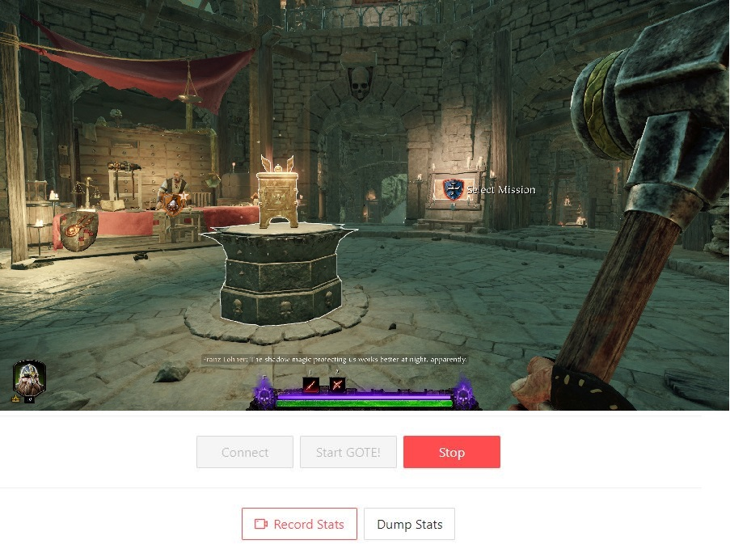

# GOTE Game Server 2

The Gaming On The Edge (GOTE) architecture aims to enable complex games to be remotely played on smartphones and other edge devices while leveraging edge computing infrastructure into graphics processing and content distribution systems. This GOTE **architecture's proof of concept (POC)** is developed and tested using a RTP streaming pipeline with WebRTC that exploits NVENC for achieving low latency video encoding. Experimental results show that GOTE architecture is a viable alternative to cloud based remote gaming on smartphones at the advantage of lowering latency of video and game input.

## Brief overview

This implementation covers the rendering server and the player client web application components.

* The rendering server is responsible for running the game instance and streaming it to the player client. It is also responsible for receiving game input commands from the player client.
* The player client is a web application that runs on a WebRTC compliant web browser (such as Chrome, or Firefox) and displays the game stream.

## Requirements for running this POC

* Windows (for running a streamable game).
* Java 11 or later (for running the rendering server application).
* GStreamer (refer to this [documentation](https://gstreamer.freedesktop.org/documentation/installing/on-windows.html))
* NVIDIA Video Codec SDK [requirements](https://developer.nvidia.com/nvidia-video-codec-sdk/download)

## Getting started

* Start by running `.\mvnw.cmd spring-boot:run` on the root of the project. It will start the rendering server Spring Boot application.
* Access `http://localhost:8080/`. This would be the player client web application served by the rendering server.
* Click the "Connect" button, followed by "Start GOTE!". After a brief moment your main monitor should start being streamed to the browser client.
* The GStreamer pipeline responsible for the video is [here](src/main/java/com/gpr/edgegameserver/streaming/GStreamerVideoService.java).

## Known limitations

* This POC cannot receive and interpret game input commands from the remote player client. This is will be done in the future.
* This implementation is dependant on the Windows platform, due to compatibility with a wider range of games.
* The scope of this POC does not cover audio.
* This POC does not use a TURN server for WebRTC. For this reason, streaming will not work when the peers are in different private networks, and the player client's router uses symmetric NAT.

## License

This code is made available under the GPL license enclosed with the software.

Over and above the legal restrictions imposed by this license, if you use this software for an academic publication then you are obliged to provide proper attribution. This can be to this code directly, or to the paper that describes it, or (ideally) both.
